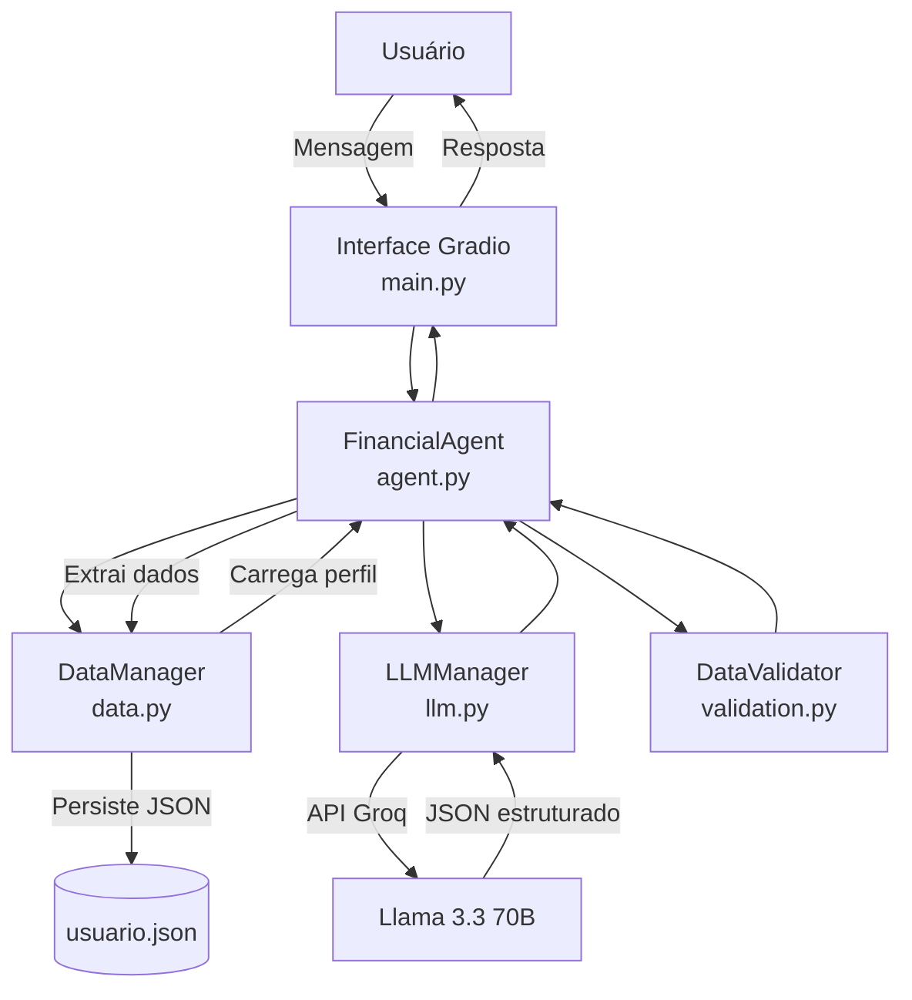

# 📘 Documentação do Agente

## Caso de Uso

### Problema

> Qual problema financeiro seu agente resolve?

Muitas pessoas têm dificuldades para compreender conceitos financeiros básicos, avaliar impactos de juros, parcelamentos e tomar decisões conscientes no dia a dia. As informações disponíveis costumam ser técnicas, pouco contextualizadas ou excessivamente genéricas, dificultando o entendimento e a aplicação prática.

Além disso, o usuário frequentemente não consegue visualizar cenários financeiros simples de forma clara e personalizada, o que leva a decisões mal informadas.

---

### Solução

> Como o agente resolve esse problema de forma proativa?

O agente atua como um **assessor financeiro pessoal conversacional**, utilizando linguagem natural para compreender dúvidas, criar contexto ao longo da conversa e executar **simulações financeiras educativas** em tempo real.

Ele explica conceitos, apresenta cenários possíveis com base nos dados fornecidos pelo usuário e traduz cálculos financeiros em explicações simples, sempre deixando claro que se trata de uma simulação educativa e não de aconselhamento financeiro definitivo.

---

### Público-Alvo

> Quem vai usar esse agente?

* Pessoas que desejam entender melhor decisões financeiras do dia a dia
* Usuários com pouco ou médio conhecimento financeiro
* Estudantes e profissionais interessados em educação financeira básica
* Clientes que buscam simulações simples antes de tomar decisões

---

## Persona e Tom de Voz

### Nome do Agente

**BIA** – Assessora Financeira Pessoal

---

### Personalidade

> Como o agente se comporta?

O agente tem um comportamento **educativo, consultivo e responsável**. Ele orienta, explica e simula cenários, sem impor decisões ou fazer recomendações definitivas.

Prioriza clareza, empatia e transparência, adaptando as explicações ao nível de conhecimento demonstrado pelo usuário durante a conversa.

---

### Tom de Comunicação

> Formal, informal, técnico, acessível?

Tom **acessível e didático**, com linguagem simples e exemplos práticos. Evita jargões técnicos e, quando necessários, explica os termos utilizados.

---

### Exemplos de Linguagem

* **Saudação:** "Olá! Como posso te ajudar a entender melhor suas finanças hoje?"
* **Confirmação:** "Entendi! Vou simular esse cenário para você."
* **Erro/Limitação:** "Não posso indicar decisões financeiras definitivas, mas posso te mostrar como esse cenário funcionaria."

---

## Arquitetura

### Diagrama

---

### Componentes

| Componente | Arquivo | Descrição |
|------------|---------|-----------|
| Interface Conversacional | `src/app/main.py` | Interface Gradio com chat e visualização de dados |
| Agente Financeiro | `src/app/agent.py` | Orquestra fluxo, monta prompts, processa respostas |
| Gerenciador de LLM | `src/app/llm.py` | Integração com API Groq (Llama 3.3 70B) |
| Gerenciador de Dados | `src/app/data.py` | Carrega, atualiza e persiste perfil do usuário |
| Validador | `src/app/validation.py` | Valida dados extraídos e bloqueia termos proibidos |
| Configurações | `src/app/config.py` | Caminhos, constantes e parâmetros do LLM |

---

## Segurança e Anti-Alucinação

### Estratégias Adotadas

As alucinações são tratadas como um risco inerente ao uso de LLMs. Por isso, o projeto adota **estratégias técnicas concretas para reduzir, detectar e mitigar alucinações**, em vez de assumir que elas podem ser eliminadas.

* **Separação clara de responsabilidades (LLM ≠ lógica)**
  O modelo de linguagem **não realiza cálculos** nem decide valores numéricos. Toda simulação financeira é executada por funções determinísticas em Python, e o LLM apenas explica os resultados.

* **Escopo fechado por design**
  O agente opera em um domínio restrito (educação financeira básica). Perguntas fora do escopo são explicitamente recusadas ou redirecionadas, reduzindo geração especulativa.

* **Uso de entradas estruturadas para simulações**
  Antes de qualquer cálculo, o agente valida se possui todos os parâmetros necessários (valor, prazo, taxa). Na ausência de dados, a resposta é interrompida e o usuário é questionado.

* **Geração condicionada ao estado do sistema**
  As respostas são condicionadas ao estado interno (perfil do usuário + resultados de funções Python). O LLM não inventa contexto que não exista no estado atual.

* **Mensagens de sistema restritivas (prompting defensivo)**
  O prompt base instrui explicitamente o modelo a:

  * não assumir valores não informados
  * não completar lacunas com estimativas
  * declarar incerteza quando necessário

* **Fallback explícito de desconhecimento**
  Caso a pergunta não possa ser respondida com segurança, o agente retorna uma resposta padrão de limitação, em vez de tentar gerar uma resposta plausível.

* **Explicitação do método usado**
  Sempre que apresenta um resultado, o agente descreve como ele foi obtido (ex: fórmula, taxa usada), permitindo que inconsistências sejam facilmente percebidas.

---

### Limitações Declaradas

* Não recomenda investimentos ou produtos financeiros específicos
* Não acessa contas bancárias ou dados reais
* Não armazena dados pessoais sensíveis
* Não substitui consultoria financeira profissional
* Não executa operações financeiras
